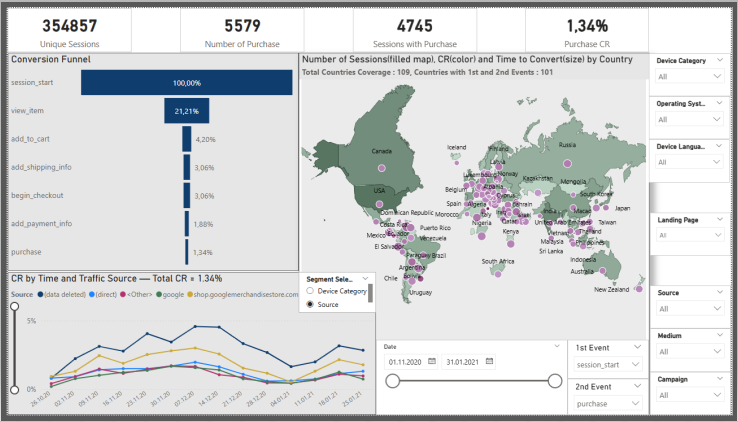
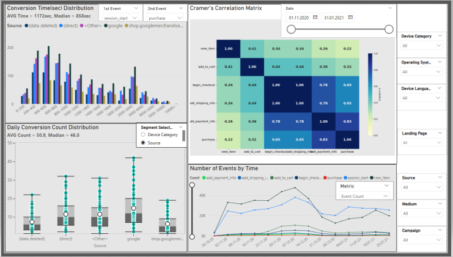
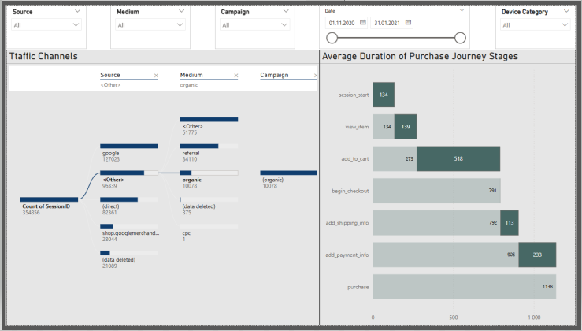

# GA4 Conversion Funnel | Power BI, Tableau & BigQuery Project 🚀

## Project Overview
The primary goal is to visualize the user journey from the 'session_start' to the final 'purchase' through such stages as 'view_item', 'add_to_cart', 'begin_checkout', 'add_shipping_info', 'add_payment_info', identifying where potential customers drop off and how different user segments behave throughout the funnel. Data is sourced from the `ga4_obfuscated_sample_ecommerce` public dataset, containing 4M+ rows of session data from November 1, 2020, to January 31, 2021. Unfortunately, neither the full CSV file extracted from BigQuery nor the Power BI .pbix file can be included in the repository due to their sizes (138 MB and 88 MB respectively). The first 500 rows of data are provided in the ga4_conversion_funnel_sample.csv file. The link to the full dataset is here: [Link](https://drive.google.com/file/d/1de58cEZOWrLjjCqQTtMt2_MUJfmkAgas/view?usp=sharing)  
Project visualization was developed in two versions: Power BI Report and Tableau Dashboard.

## Key Objectives: 🎯
* <b>Funnel Visualization:</b> Map the progression between key events: session_start → view_item → add_to_cart → begin_checkout → add_shipping_info → add_payment_info → purchase.
* <b>User Segmentation:</b> Analyze how conversion rates vary across different dimensions such as Traffic Source, Device Category, and Geographic Location.
* <b>Behavioral Relationships:</b> Discover correlations between micro-conversions (e.g., viewing a product) and the final conversion rate (CR) to optimize the marketing budget.
* <b>Time-to-Conversion:</b> Track event timestamps to measure the duration between funnel stages.

## Tech Stack: ⚒️
* <b>Data Source:</b> Google Analytics 4 (BigQuery Public Dataset): `bigquery-public-data.ga4_obfuscated_sample_ecommerce`
* <b>Data Extraction:</b> Advanced SQL query in BigQuery.
* <b>Visualization & Modeling:</b> Power BI and Tableu for creating an interactive dashboards. 
* <b>Metrics Calculation:</b> Developed business logic using DAX in Power BI and a combination of LOD expressions and Calculated Fields in Tableau.

## SQL Highlights: ⭐
This section demonstrates the core data transformation logic used to process raw GA4 events from BigQuery.
   *  <b>Data Flattening:</b> Unnested GA4 event parameters to transform hierarchical JSON-like data into a flat relational structure.
   *  <b>Data Quality & Cleaning:</b> Filtered 7 key funnel events and handled session inconsistencies (removed sessions with multiple or missing session_start).
   *  <b>Scale:</b> Successfully processed a final table of 867K+ rows for Power BI visualization.

<details>
<summary><b>👉 Code querying data from BigQuery is here:</b></summary>

```sql
WITH init AS (
  SELECT timestamp_micros(event_timestamp) AS event_timestamp,
      (SELECT value.int_value FROM UNNEST(event_params) WHERE key = 'ga_session_id') AS session_id ,
          user_pseudo_id || '+' ||
          CAST((SELECT value.int_value FROM UNNEST(event_params) WHERE key = 'ga_session_id') AS string) AS user_session_id, 
      event_name,
      REGEXP_EXTRACT(
                (SELECT value.string_value FROM UNNEST(event_params) WHERE key = 'page_location'), 
                            r'(?:\w+:\/\/)?[^\/]+\/(.*)') AS landing_page_location,
      traffic_source.source AS sourse, traffic_source.medium AS medium, traffic_source.name AS campaign,
      geo.country AS country, device.category AS device_category, 
      device.operating_system AS operating_system,
      device.language AS device_language
  FROM `bigquery-public-data.ga4_obfuscated_sample_ecommerce.events_*`
  WHERE event_name IN ('session_start', 'view_item', 'add_to_cart', 'begin_checkout',
                        'add_shipping_info', 'add_payment_info', 'purchase')
  ),
rank1 as (
  SELECT *, 
     ROW_NUMBER() OVER (PARTITION BY user_session_id ORDER BY event_timestamp ASC ) AS rn
  FROM init
  WHERE event_name = 'session_start'
  ),
init_filtered AS (
  SELECT event_timestamp,
        session_id, user_session_id,
        event_name,
        landing_page_location,
        sourse, medium, campaign,
        country, device_category,
        operating_system, device_language
  FROM rank1
  WHERE rn = 1
  UNION ALL
  SELECT *
  FROM init
  WHERE event_name <> 'session_start' --877 538
  ),
start_table as (
  SELECT user_session_id
  FROM init_filtered
  WHERE event_name = 'session_start'
  )
SELECT i.event_timestamp,
        i.session_id, st.user_session_id,
        i.event_name,
        i.landing_page_location,
        i.sourse, i.medium, i.campaign,
        i.country, i.device_category,
        i.operating_system, i.device_language
FROM start_table st LEFT JOIN init_filtered i 
ON st.user_session_id = i.user_session_id
```
</details>
 
## Power BI Gallery
1. 


2.


3.


👉[Watch Power BI report video review](https://drive.google.com/file/d/1LuuwnS-S5D4HYdjOM13_iF8XBXzkgG9V/view?usp=sharing)


## Power BI Highlights: ⭐

### 🔹 <b>Data Modelling</b>
 
<details>
<summary>Data modele scheme is here:</summary>


</details>

* To enable deep analysis, I developed a GA4 Session-Event Fact Table(GAFT). In the GAFT table, data aggregation ensures that each session contains only one unique occurrence of each event type. This step is essential for the subsequent calculation of time intervals between funnel stages.
<details>
<summary>DAX code for creating Calculated Table GAFT:</summary>

```
GAFT =
ADDCOLUMNS (
    SUMMARIZE (
        GA4,
        GA4[user_session_id],
        GA4[event_name],
        "FirstEventTime",
            CALCULATE (
                MIN ( GA4[event_datetime] )
            )
    ),
    "Source", CALCULATE ( SELECTEDVALUE(GA4[source])),
    "Medium", CALCULATE ( SELECTEDVALUE(GA4[medium])),
    "Campaign", CALCULATE ( SELECTEDVALUE(GA4[campaign])),
    "Device Category",  CALCULATE (SELECTEDVALUE(GA4[device_category])),
    "Operating System", CALCULATE (SELECTEDVALUE(GA4[operating_system])),
    "Device Language",  CALCULATE (SELECTEDVALUE(GA4[device_language])),
    "Landing Page",  CALCULATE (SELECTEDVALUE(GA4[landing_page_location])),
    "Country",  CALCULATE (SELECTEDVALUE(GA4[country]))
)
```
</details>

* To build correlation matrix, a DAX calculated table GAFT_Pivoted, that transforms the long event list into a wide format, was developed. Each session is mapped against 7 core events to identify behavioral patterns and event-to-event dependencies using a correlation matrix.

<details>
<summary>DAX code for creating Calculated Table GAFT_Pivoted:</summary>

```
GAFT_Pivoted =
SUMMARIZE(
    GAFT,
    GAFT[SessionID],

    -- 1. session_start
    "session_start",
        IF(
            CALCULATE(
                COUNTROWS(GAFT),
                FILTER(GAFT, GAFT[Event] = "session_start")
            ) > 0,
            1,
            0
        ),


    -- 2. view_item
    "view_item",
        IF(
            CALCULATE(
                COUNTROWS(GAFT),
                FILTER(GAFT, GAFT[Event] = "view_item")
            ) > 0,
            1,
            0
        ),


    -- 3. add_to_cart
    "add_to_cart",
        IF(
            CALCULATE(
                COUNTROWS(GAFT),
                FILTER(GAFT, GAFT[Event] = "add_to_cart")
            ) > 0,
            1,
            0
        ),


    -- 4. begin_checkout
    "begin_checkout",
        IF(
            CALCULATE(
                COUNTROWS(GAFT),
                FILTER(GAFT, GAFT[Event] = "begin_checkout")
            ) > 0,
            1,
            0
        ),


    -- 5. add_shipping_info
    "add_shipping_info",
        IF(
            CALCULATE(
                COUNTROWS(GAFT),
                FILTER(GAFT, GAFT[Event] = "add_shipping_info")
            ) > 0,
            1,
            0
        ),


    -- 6. add_payment_info
    "add_payment_info",
        IF(
            CALCULATE(
                COUNTROWS(GAFT),
                FILTER(GAFT, GAFT[Event] = "add_payment_info")
            ) > 0,
            1,
            0
        ),


    -- 7. purchase
    "purchase",
        IF(
            CALCULATE(
                COUNTROWS(GAFT),
                FILTER(GAFT, GAFT[Event] = "purchase")
            ) > 0,
            1,
            0
        )
)
```
</details>

### 🔹 <b>DAX Measures</b>
The full analytical model includes 50+ custom DAX measures for deep analysis. Below are some of them:

<details>
<summary>Calculating the conversion rate from one selected event to a second selected event by country.</summary>

```
CR Country =
VAR FirstEvent =
    SELECTEDVALUE( FirstEventSelector[1st Event] )

VAR SecondEvent =
    SELECTEDVALUE( SecondEventSelector[2nd Event] )

VAR TotalSessions =
    -- count the total number of unique sessions where the 1st Event occurred.
    CALCULATE(
              DISTINCTCOUNT(GAFT[SessionID]),
              FILTER(
                    ALLEXCEPT(GAFT, GAFT[Country]),
                    GAFT[Event] = FirstEvent
                    )      
    )

VAR EventSessions =
    -- count the total number of unique sessions where the 2nd Event occurred.
    CALCULATE(
              DISTINCTCOUNT(GAFT[SessionID]),
              FILTER(
                    ALLEXCEPT(GAFT, GAFT[Country]),
                    GAFT[Event] = SecondEvent
                   )
             )

RETURN
    DIVIDE(
        EventSessions,
        TotalSessions
    )
```
</details>

<details>
<summary>Calculating the start times for Gantt chart "Average Duration of Purchase Journey Stages". </summary>

```
Combined Start Time (sec) =
VAR CurrentRank = SELECTEDVALUE('Event Order Table'[Event Rank])

RETURN
    CALCULATE(
        SUMX(
            ALL('Event Order Table'),
            IF(
                'Event Order Table'[Event Rank] <= CurrentRank,
                [Combined Duration],
                0
            )
        )
    )
```
</details>

### 🔹 <b>Python</b>

<details>
<summary>Python script for creating Cramer's Correlation Matrix. </summary>

```python
import pandas as pd
import numpy as np
from scipy.stats import chi2_contingency
import seaborn as sns
import matplotlib.pyplot as plt

# 1. Download and copy the input data frame provided by Power BI.
df = dataset.copy()

events_to_analyze = ["view_item", "add_to_cart", "begin_checkout", "add_shipping_info", "add_payment_info", "purchase"]

# 5. Function for calculating Cramer V coefficient.
def cramers_v_uncorrected(cm):
    """
    Calculates Cramer's V (a measure of association for categorical/binary variables).
    Uses the uncorrected formula, which is better suited for large datasets.
    """
    # provide a complete 2x2 table, filling with zeros if combinations are missing
    cm = cm.reindex(index=[0,1], columns=[0,1], fill_value=0)
    n = cm.values.sum()
   
    if n == 0 or cm.empty:
        return 0.0

    # Check for constant columns/rows
    if (cm.sum(axis=0) == 0).any() or (cm.sum(axis=1) == 0).any():
        return 0.0
       
    try:
        chi2 = chi2_contingency(cm)[0]
    except Exception:
        return 0.0
   
    phi2 = chi2 / n
    r, k = cm.shape
   
    denom = min(r - 1, k - 1)
    if denom == 0:
        return 0.0
       
    return np.sqrt(phi2 / denom)

# 6. Construction of Cramer V matrix
matrix = pd.DataFrame(index=events_to_analyze, columns=events_to_analyze, dtype=float)

for e1 in events_to_analyze:
    for e2 in events_to_analyze:
        cm = pd.crosstab(df[e1], df[e2])
        matrix.loc[e1, e2] = cramers_v_uncorrected(cm)

# 8. Construction of blank heat map
fig = plt.figure(figsize=(12, 8), facecolor='#E8E8E8')

#  Matrix size
ax = fig.add_axes([0.13, 0.05, 0.87, 0.8])

annotation_font = {
    'fontsize': 14,
    'fontweight': 'bold'
}

sns.heatmap(
    matrix.astype(float),
    annot=True,
    cmap='YlGnBu',
    vmin=0,
    vmax=1,
    fmt=".2f",
    cbar_kws={'label': "Cramer's V", 'shrink': .75},
    annot_kws=annotation_font,
    ax=ax
)
# ax.set_title("Cramer's V Correlation Matrix", fontsize=16)
ax.tick_params(axis='both', labelsize=12)

# Ensuring a clean background
ax.set_facecolor('#E8E8E8')
ax.patch.set_facecolor('#E8E8E8')
ax.patch.set_alpha(1.0)

plt.show()
```
</details>


## Tableau Gallery

👉 [Link to Tableau Public Dashboard](https://public.tableau.com/views/GA4ConversionFunnelProject/DashboardConversion2?:language=en-US&:sid=&:redirect=auth&:display_count=n&:origin=viz_share_link)


## Tableau Highlights: ⭐

<details>
<summary>Calculating the unique session count for every combination of event and selected parameter.</summary>

```
{FIXED [event_name], [Dimension Selector]: COUNTD([user_session_id])}
```
</details>

## Feedback and Collaboration 🙌

If you have any feedback regarding the data modeling, DAX formulas, or visualization choices, please open an issue or reach out to me directly. I'm also open to collaboration and welcome any contributions that could enhance the report's functionalities!

